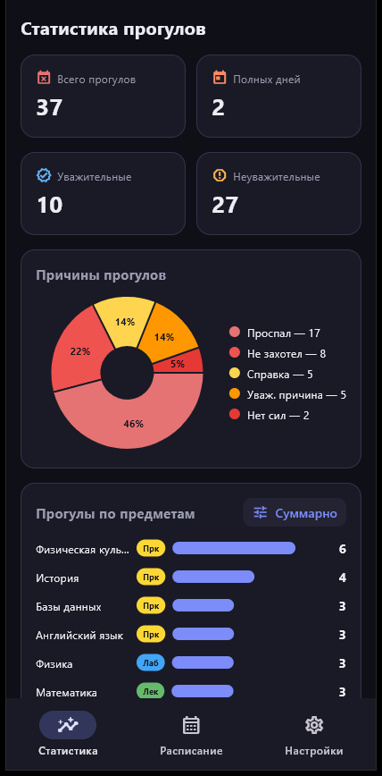
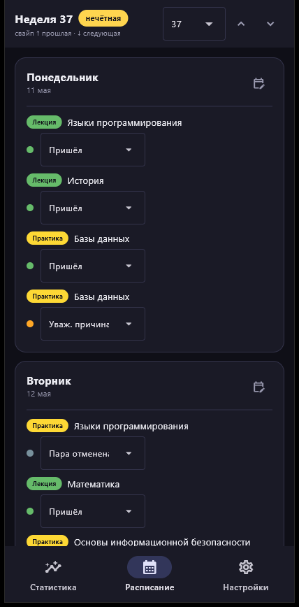
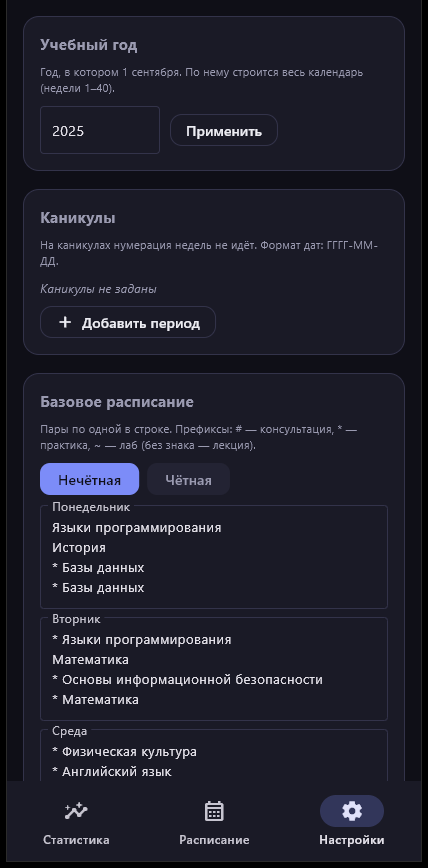

<div align="center">


# SkipKOB_Helper

**Приложение для учёта прогулов в университете**

Тёмная тема · Android и Windows · всё хранится локально


</div>

---

Отмечаешь, был ли ты на паре — приложение считает статистику: сколько прогулов,
сколько из них по уважительной причине, сколько дней пропущено полностью и по каким
предметам ты пропускаешь чаще всего. Отмечать можно как в течение дня, так и постфактум.

## Скриншоты

<div align="center">
<table>
<tr>
<td align="center"><b>Статистика</b></td>
<td align="center"><b>Расписание</b></td>
<td align="center"><b>Настройки</b></td>
</tr>
<tr>
<td></td>
<td></td>
<td></td>
</tr>
</table>
</div>

## Возможности

### 📊 Статистика
- Счётчики: всего прогулов, полных пропущенных дней, уважительные / неуважительные.
- Круговая диаграмма причин — похожие причины различаются оттенками.
- Прогулы по предметам в двух режимах: **суммарно** и **детально** (отдельно
  лекции, практики и лабораторные по каждому предмету).
- Отдельный блок «не считается прогулом»: освобождён от пары, отменённые пары,
  посещённые консультации.

### 📅 Расписание
- Учебные недели **1–40**, чётные и нечётные с разным базовым расписанием.
- Переключение недель кнопками, выбором или **свайпом** (потянуть список за верх/низ).
- У каждой пары цветной значок типа: <kbd>Лекция</kbd> <kbd>Практика</kbd>
  <kbd>Лабораторная</kbd> <kbd>Консультация</kbd>.
- Статус для каждой пары: пришёл · справка · уваж. причина · проспал · не захотел ·
  нет сил · всё сдал · пара отменена.
- Изменения расписания на конкретный день, не ломая базовое расписание.
- Последняя открытая неделя запоминается.

### ⚙️ Настройки
- Учебный год (по 1 сентября строится весь календарь).
- **Каникулы** — на них нумерация недель останавливается.
- Редактор базового расписания на чётную и нечётную неделю.
- Экспорт / импорт расписания (`.conf` / `.json`).
- Экспорт отчёта о прогулах в Markdown — удобно и читать, и скормить ИИ для анализа.
- Полный сброс с предупреждением и таймером (защита от случайного нажатия).

## Как считается «полный пропущенный день»

Учитываются только «зачётные» пары — без консультаций, отменённых пар и «всё сдал».

| Ситуация | Результат |
|---|---|
| Все пары отменены / всё сдано | день **не** пропущен |
| Хоть на одной паре «пришёл» | день **не** пропущен |
| Все зачётные пары пропущены (любая причина) | день пропущен **полностью** |
| Половина отменена, половина прогуляна | день пропущен **полностью** |

## Установка и запуск

```bash
git clone https://github.com/Arkorij/SkipKOB_helper.git
cd SkipKOB_helper
pip install -r requirements.txt
python main.py
```

Требуется Python 3.9+ (проверено на 3.12 и 3.14). При первом запуске Flet
автоматически докачает свой desktop-клиент.

## Сборка

```bash
flet build apk        # Android (.apk)
flet build windows    # Windows
```

Иконка приложения берётся из `assets/icon.png`.

## Формат расписания

Пары задаются по одной в строке. Префиксы в начале строки:

| Префикс | Значение |
|---|---|
| *(нет)* | лекция |
| `*` | практика |
| `~` | лабораторная |
| `#` | консультация |

Пример: `#~ Физика` — консультация по лабораторной. Префиксы комбинируются.

Файл импорта (`.conf` / `.json`) содержит `academic_year_start`, `breaks` и
`base_schedule`; пары хранятся как
`{"name": "...", "kind": "lecture|practice|lab", "consultation": false}`.
Импорт перезаписывает базовое расписание, **не трогая** уже проставленные отметки.
Пример готового файла — [`schedule_SO211KOB.conf`](schedule_SO211KOB.conf).

## Хранение данных

Всё локально, никаких серверов и аккаунтов:

- **Windows:** `%APPDATA%\SkipKOB_Helper\data.json`
- **Android / собранное приложение:** каталог `FLET_APP_STORAGE_DATA`

Перенос между устройствами — через экспорт и импорт файла расписания.

## Структура проекта

```
main.py                 # точка входа, тема, навигация
app/
  models.py             # статусы, типы занятий, разбор строки пары
  calendar_logic.py     # учебный календарь: недели, чётность, каникулы
  resolver.py           # какие пары в конкретный день + отметки
  stats.py              # подсчёт статистики
  report.py             # Markdown-отчёт
  storage.py            # локальное JSON-хранилище, экспорт/импорт
  ui/
    theme.py            # палитра тёмной темы
    widgets.py          # переиспользуемые виджеты
    stats_page.py       # страница «Статистика»
    schedule_page.py    # страница «Расписание»
    settings_page.py    # страница «Настройки»
```
